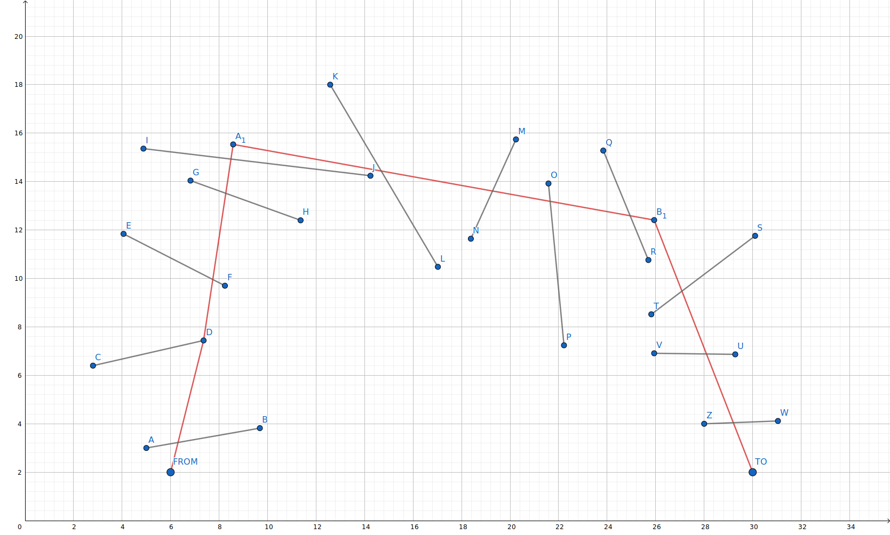

Challenge #3 - shortest path
=====

Path finding algorithms and computational geometry are at core of marine routing and navigation systems. Water depth, vessel dimension, weather conditions, UX (speed, flexibility, presentation) are some of the core challenges of marine navigation solutions that require thinking outside of the box of conventional land network based navigation solutions.

Task
-----
Given a start point and an end point and a list of gateway line segments, find a shortest path from start to end that goes through gateway segments in order.

Details and Hints
-----
* Gateway line segments are ordered, which is determined by letters order, A-B is before C-D, and shell be visited in such order
* Gateway line segments are oriented in respect to travel (start->end): lower letter is left, higher letter is right (e.g. in segment A-B, A is left and B is right)
* Gateway line segments don't intersect
* Traversal between consecutive segments is possible in straight line so that any path from start to end following above requirements will have all left points from gateway segments on its left side and all right points from gateway segments on its right side
* Use C++ and preferably [libgeos](https://github.com/libgeos/geos/tree/3.10.1)

Example
-----

The following is an example of the setup with FROM (start) and TO (end) points and 12 gateway segments.

The red polyline is a path connecting start and end points following above requirements except it's not the shortest such path.

##### Example graph
[View at GeoGebra](https://www.geogebra.org/geometry/d6nepsnu)



##### Gateway segments points as array of left, right points pairs.
```json
[
  {
    "label": "A",
    "x": 5,
    "y": 3
  },
  {
    "label": "B",
    "x": 9.68,
    "y": 3.82
  },
  {
    "label": "C",
    "x": 2.8,
    "y": 6.4
  },
  {
    "label": "D",
    "x": 7.36,
    "y": 7.44
  },
  {
    "label": "E",
    "x": 4.06,
    "y": 11.84
  },
  {
    "label": "F",
    "x": 8.24,
    "y": 9.7
  },
  {
    "label": "G",
    "x": 6.82,
    "y": 14.04
  },
  {
    "label": "H",
    "x": 11.36,
    "y": 12.4
  },
  {
    "label": "I",
    "x": 4.88,
    "y": 15.36
  },
  {
    "label": "J",
    "x": 14.24,
    "y": 14.24
  },
  {
    "label": "K",
    "x": 12.58,
    "y": 18
  },
  {
    "label": "L",
    "x": 17.02,
    "y": 10.48
  },
  {
    "label": "M",
    "x": 20.24,
    "y": 15.74
  },
  {
    "label": "N",
    "x": 18.38,
    "y": 11.64
  },
  {
    "label": "O",
    "x": 21.58,
    "y": 13.92
  },
  {
    "label": "P",
    "x": 22.22,
    "y": 7.24
  },
  {
    "label": "Q",
    "x": 23.84,
    "y": 15.28
  },
  {
    "label": "R",
    "x": 25.7,
    "y": 10.76
  },
  {
    "label": "S",
    "x": 30.1,
    "y": 11.76
  },
  {
    "label": "T",
    "x": 25.82,
    "y": 8.52
  },
  {
    "label": "U",
    "x": 29.282,
    "y": 6.866
  },
  {
    "label": "V",
    "x": 25.938,
    "y": 6.91
  },
  {
    "label": "W",
    "x": 31.042,
    "y": 4.116
  },
  {
    "label": "Z",
    "x": 28,
    "y": 4
  },
]
```
##### Start and end point
```json
[
  {
    "label": "FROM",
    "x": 6,
    "y": 2
  },
  {
    "label": "TO",
    "x": 30,
    "y": 2
  }
]
```

Deliverable
-----
Url to video demonstrating the solution or source code or only algo explanation (if you find this easy).
